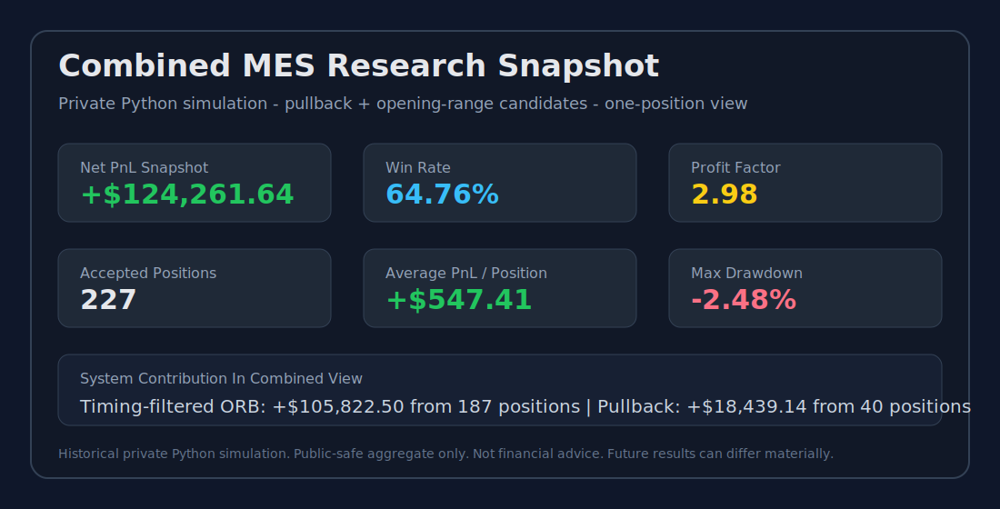

# Quant Research Platform - Public Overview

This repository is a public, read-only overview of an active quantitative research project focused on futures strategy research, backtesting, and TradingView deep-test validation.

The implementation code, Pine scripts, datasets, private research notebooks, and executable strategy logic are intentionally not included here.

## Quick Links

- [MES Futures Research Case Study](case-studies/mes-futures-research.md)
- [MNQ Structure Research Case Study](case-studies/mnq-structure-research.md)
- [Performance Snapshots](performance-snapshots.md)
- [Validation Methodology](validation-methodology.md)
- [Risk Principles](risk-principles.md)
- [Research Log](research-log.md)
- [Roadmap](roadmap.md)
- [FAQ](faq.md)

## Visual Snapshot




## Purpose

The project tracks high-level research progress for a futures trading research platform, including:

- Strategy research notes
- Backtest summaries
- Risk-management findings
- TradingView deep-test observations
- Explainable trade-decision diagnostics
- Paper-trading readiness milestones
- Broker-fed alerting milestones
- Future improvement ideas

This repository is meant for visibility and communication only. It is not the working source-code repository.

## Current Research Focus

The current research covers Micro E-mini S&P 500 (`MES`) and Micro E-mini Nasdaq-100 (`MNQ`) futures, with special attention to:

- Avoiding entries that chase price too far from the EMA pullback zone
- Studying a combined one-position workflow for selective pullback and opening-range behavior
- Improving partial profit-taking behavior
- Keeping scaled runners alive when trend conditions continue
- Reducing large daily-loss events
- Comparing Python backtests with TradingView deep-test exports
- Separating strong entry windows from weak entry windows
- Building a journal-style review process for every trade and every no-trade day
- Comparing trend-pullback, opening-range, and market-structure behaviors without mixing ownership of the same broker position
- Operating a guarded broker-fed paper workflow with phone alerts before considering any live execution

## Current High-Level Findings

Recent research suggests the strategy behaves better when:

- Entries remain close to the EMA 21 / EMA 50 pullback area
- Weak short-entry windows are filtered out
- Full positions are managed differently from scaled runner positions
- Scaled runner contracts are allowed to continue after partial profits
- Daily max-loss exits are treated as a warning sign, not a preferred exit style
- Daily checklists make it easier to separate valid no-trade days from missed opportunities
- Automated execution should remain restricted to a paper account with explicit account, data, size, position, duplicate-event, and single-process safeguards
- Python-based monitoring is the preferred execution reference when chart-platform historical fill modeling materially differs from private backtest assumptions
- Phone notifications can now be tested independently from broker order routing, which reduces integration risk
- Opening-range entries improve when weaker time windows are excluded and the remaining windows are validated across multiple years

These findings are still under active validation and may change as more data is tested.

## Latest Milestone

On July 17, 2026, the private implementation advanced from broker-fed alerts to guarded IBKR paper execution. The workflow now evaluates MES and MNQ strategies from real-time broker data, sends Telegram lifecycle notifications, and routes only explicitly selected strategy events to a paper account. Live-account execution remains blocked.

Operational controls now include paper-account validation, real-time-data validation, contract-size caps, position-aware exits, persistent event and order references, and a single-instance process lock. The terminal remains quiet during routine polling while fills and failures stay visible.

The latest MNQ research also demonstrated disciplined rejection of a plausible idea. A delayed-confirmation entry variant produced lower profit factor, lower simulated PnL, and higher drawdown than the original same-bar confirmation baseline, so it was removed from both the private Python and chart-validation implementations.

The latest private Python combined-strategy simulation, including the timing-filtered opening-range component, produced an unusually strong historical research snapshot: 227 accepted positions, approximately 64.76% win rate, approximately +$124,262 simulated net PnL, 2.98 profit factor, and approximately -2.48% max drawdown in the reviewed sample. This is treated as a research milestone, not proof of future live performance.

The related public-safe research note is tracked in:

```text
research-log.md
```

## What Is Not Included

This repository does not include:

- Source code
- Backtester implementation
- TradingView Pine Script
- Raw data
- Private optimization files
- Exact entry or exit logic
- Production trading instructions

## Risk Notice

This project is for research and educational purposes only.

Nothing in this repository is financial advice, investment advice, or a recommendation to trade futures, securities, options, crypto, or any other instrument. Futures trading is risky and can result in losses greater than the initial capital committed.

Backtest and deep-test results are historical simulations. They do not guarantee future performance.

## Ownership And Usage

Copyright (c) 2026 latherdeepak5. All rights reserved.

No permission is granted to copy, redistribute, sell, sublicense, reverse-engineer, or use private implementation details from the underlying project. Public text in this overview is provided only so collaborators and reviewers can understand the high-level research direction.

## Status

Active research. This overview will be updated as the project evolves.
