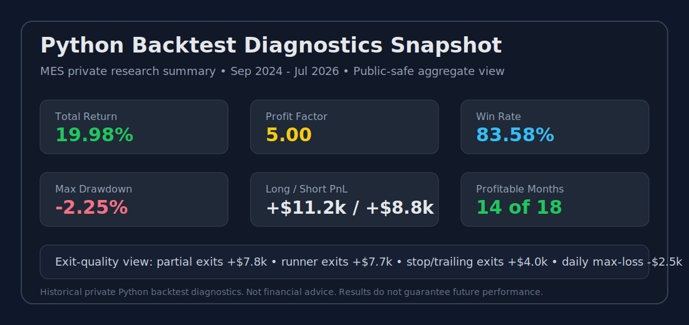

# Performance Snapshots

This page records high-level public research snapshots. These are not trading recommendations and do not include exact strategy logic.

## Snapshot: MES Deep-Test Review, 2020-2026

| Field | Value |
|---|---:|
| Instrument | MES |
| Approximate range | Jan 2020 - Jul 2026 |
| Net profit | +$22,682.50 |
| Return on initial capital | 22.68% |
| Profit factor | 1.53 |
| Max drawdown, intrabar | 7.10% |
| Long contribution | +$12,922.50 |
| Short contribution | +$9,760.00 |
| Grouped positions reviewed | 155 |

## Snapshot: MES Recent Deep-Test Review, 2024-2026

| Field | Value |
|---|---:|
| Instrument | MES |
| Approximate range | Sep 2024 - Jul 2026 |
| Net profit | +$18,286.25 |
| Return on initial capital | 18.29% |
| Profit factor | 1.658 |
| Max drawdown, intrabar | 8.82% |
| Long contribution | +$10,820.00 |
| Short contribution | +$7,466.25 |
| Grouped positions reviewed | 78 |

## Snapshot: Private Python Diagnostics Review, 2024-2026

| Field | Value |
|---|---:|
| Instrument | MES |
| Approximate range | Sep 2024 - Jul 2026 |
| Final capital | $121,307.52 |
| Total return | 21.31% |
| Profit factor | 5.27 |
| Win rate | 84.06% |
| Max drawdown | -2.25% |
| Long contribution | +$12,565.37 |
| Short contribution | +$8,782.14 |
| Closed trade rows reviewed | 69 |

## Monthly Consistency Snapshot

| Metric | Value |
|---|---:|
| Profitable months reviewed | 14 of 18 |
| Best month | Apr 2026, +$5,927.06 |
| Weakest month | Jan 2026, -$1,127.00 |

## Exit-Quality Snapshot

| Exit Category | Closed Rows | Aggregate PnL |
|---|---:|---:|
| Partial profit exits | 29 | +$8,190.20 |
| Runner exits | 11 | +$8,626.50 |
| Stop / trailing exits | 16 | +$4,007.57 |
| Daily max-loss exits | 3 | -$2,473.00 |

## Visual Snapshot: Python Diagnostics

## Interpretation Notes

- Results are historical simulations and may not match live execution.
- Gross profit is less important than clean trade selection, drawdown behavior, and stability across regimes.
- Daily max-loss exits are reviewed as a risk warning category.
- Runner contribution is tracked separately from initial partial profit-taking.
- Long and short systems are reviewed separately because they often behave differently.
- Python diagnostics are used to understand behavior; TradingView deep tests are used as a separate validation layer.
- Daily decision matrices are used to review both trade days and no-trade days.
- Paper-trading monitoring is treated as a validation step, not proof of live readiness.

## What These Snapshots Do Not Show

These snapshots do not include:

- Exact rules
- Source code
- Pine script
- Trade-by-trade exports
- Private optimization files
- Live trading performance

## Research Standard

A result is considered more useful when it improves risk-adjusted behavior, reduces avoidable drawdown, and remains interpretable across different market periods.
