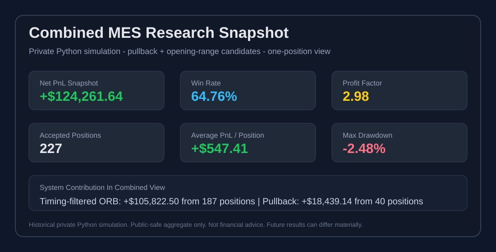
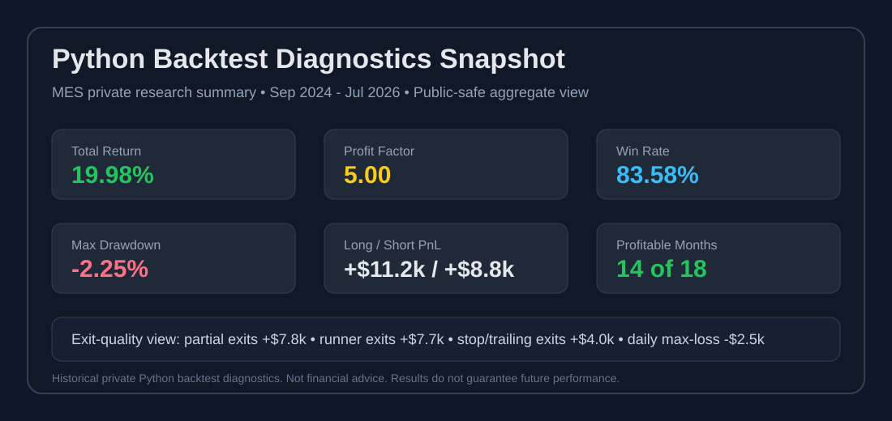
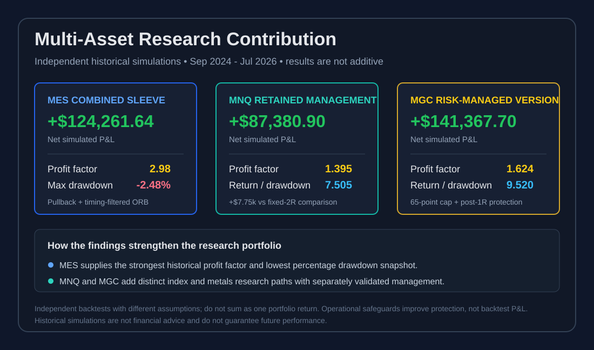

# Performance Snapshots

This page records high-level public research snapshots. These are not trading recommendations and do not include exact strategy logic.

## Snapshot: MNQ Structure Hypothesis Comparison

This private comparison tested whether retaining an earlier structure signal until a later confirmation would improve opportunity capture. It did not. The original stricter confirmation remained superior and the delayed branch was rejected.

| Research view | Trades | Win rate | Net simulated PnL | Profit factor | Max drawdown |
|---|---:|---:|---:|---:|---:|
| Original confirmation baseline | 520 | 36.54% | +$109,217 | 1.39 | -$24,787.50 |
| Delayed-confirmation branch | 50 | 28.00% | -$6,095 | 0.73 | -$10,245.00 |
| Combined experimental result | 570 | 35.79% | +$103,122 | 1.34 | -$26,785.75 |

The reviewed sample used local MNQ 15-minute data from September 2024 through July 2026, five micro contracts, and estimated commissions without slippage. These are historical simulations, not paper or live returns.

## Snapshot: Combined MES One-Position Python Research

This private Python simulation combined the selective MES pullback research path with an opening-range research path, then replayed both through a one-position-at-a-time account view. The result was an unusually strong historical research snapshot, but it remains a simulation and is not live performance.

| Field | Value |
|---|---:|
| Instrument | MES |
| Timeframe reviewed | 15-minute futures bars |
| Account view | Combined one-position-at-a-time |
| Accepted positions | 227 |
| Win rate | 64.76% |
| Net simulated PnL | +$124,261.64 |
| Average PnL per position | +$547.41 |
| Profit factor | 2.98 |
| Max drawdown | -2.48% |

### Asset And System Contribution Snapshot

| Asset / System View | Positions | Win Rate | Net Simulated PnL | Profit Factor |
|---|---:|---:|---:|---:|
| MES combined one-position view | 227 | 64.76% | +$124,261.64 | 2.98 |
| MES timing-filtered opening-range contribution | 187 | 62.03% | +$105,822.50 | 2.85 |
| MES pullback contribution inside combined view | 40 | 77.50% | +$18,439.14 | 4.38 |

### Yearly Combined Snapshot

| Year | Accepted Positions | Win Rate | Net Simulated PnL | Profit Factor |
|---|---:|---:|---:|---:|
| 2024 | 33 | 66.67% | +$13,622.64 | 2.92 |
| 2025 | 128 | 62.50% | +$61,977.85 | 2.72 |
| 2026 | 66 | 68.18% | +$48,661.15 | 3.49 |

## Snapshot: MES Deep-Test Review, 2020-2026

| Field | Value |
|---|---:|
| Instrument | MES |
| Approximate range | Jan 2020 - Jul 2026 |
| Net profit | +$22,682.50 |
| Return on initial capital | 22.68% |
| Profit factor | 1.53 |
| Max drawdown, intrabar | 7.10% |
| Long contribution | +$12,922.50 |
| Short contribution | +$9,760.00 |
| Grouped positions reviewed | 155 |

## Snapshot: MES Recent Deep-Test Review, 2024-2026

| Field | Value |
|---|---:|
| Instrument | MES |
| Approximate range | Sep 2024 - Jul 2026 |
| Net profit | +$18,286.25 |
| Return on initial capital | 18.29% |
| Profit factor | 1.658 |
| Max drawdown, intrabar | 8.82% |
| Long contribution | +$10,820.00 |
| Short contribution | +$7,466.25 |
| Grouped positions reviewed | 78 |

## Snapshot: Private Python Diagnostics Review, 2024-2026

| Field | Value |
|---|---:|
| Instrument | MES |
| Approximate range | Sep 2024 - Jul 2026 |
| Final capital | $121,307.52 |
| Total return | 21.31% |
| Profit factor | 5.27 |
| Win rate | 84.06% |
| Max drawdown | -2.25% |
| Long contribution | +$12,565.37 |
| Short contribution | +$8,782.14 |
| Closed trade rows reviewed | 69 |

## Monthly Consistency Snapshot

| Metric | Value |
|---|---:|
| Profitable months reviewed | 14 of 18 |
| Best month | Apr 2026, +$5,927.06 |
| Weakest month | Jan 2026, -$1,127.00 |

## Exit-Quality Snapshot

| Exit Category | Closed Rows | Aggregate PnL |
|---|---:|---:|
| Partial profit exits | 29 | +$8,190.20 |
| Runner exits | 11 | +$8,626.50 |
| Stop / trailing exits | 16 | +$4,007.57 |
| Daily max-loss exits | 3 | -$2,473.00 |

## Visual Snapshot: Python Diagnostics

## Interpretation Notes

- Results are historical simulations and may not match live execution.
- Gross profit is less important than clean trade selection, drawdown behavior, and stability across regimes.
- Daily max-loss exits are reviewed as a risk warning category.
- Runner contribution is tracked separately from initial partial profit-taking.
- Long and short systems are reviewed separately because they often behave differently.
- Python diagnostics are used to understand behavior; TradingView deep tests are used as a separate validation layer.
- Daily decision matrices are used to review both trade days and no-trade days.
- Guarded paper execution is treated as a validation step, not proof of live readiness.
- The combined one-position snapshot is considered exceptional historically, but it must still pass broker-fed alert monitoring before any order-routing decision.

## Snapshot: Multi-Asset Research Contribution, 2024-2026

These are independent private simulations. They are shown as research sleeves
and must not be summed into a single portfolio return because capital,
correlation, overlapping exposure, and execution assumptions have not yet been
modeled in one unified portfolio backtest.

| Research sleeve | Retained view | Trades / positions | Net simulated P&L | Profit factor | Drawdown measure |
|---|---|---:|---:|---:|---:|
| MES | Combined one-position pullback + ORB | 227 | +$124,261.64 | 2.98 | -2.48% |
| MNQ | 0.5R step trail after 2R | 521 | +$87,380.90 | 1.395 | -$11,643.00 |
| MGC | Risk-managed structure version | 481 | +$141,367.70 | 1.624 | -$14,849.00 |

### Incremental Findings

| Finding | Comparison | Simulated net-P&L change | Profit-factor change | Risk interpretation |
|---|---|---:|---:|---|
| MNQ 0.5R step management | Versus fixed 2R partial | +$7,754.40 | 1.360 to 1.395 | Return-to-drawdown improved from 7.211 to 7.505; absolute drawdown increased by about $600 |
| MGC confirmation-aware exit | Versus immediate opposite CHoCH | +$31,191.80 | 1.370 to 1.514 | Return-to-drawdown improved from 4.517 to 5.921; absolute drawdown increased by about $555 |

## Snapshot: MGC Risk-Management Comparison

The newest MGC comparison tested a 65-point maximum initial-risk distance and a
protective-stop adjustment to -0.25R after price reaches +1R.

| Scenario | Trades | Win Rate | Net Simulated P&L | Profit Factor | Max Drawdown |
|---|---:|---:|---:|---:|---:|
| Structural-stop comparison | 481 | 38.88% | +$147,941.00 | 1.620 | -$13,893.00 |
| Risk-managed version | 481 | 38.05% | +$141,367.70 | 1.624 | -$14,849.00 |

The change marginally improved profit factor but did not improve standalone MGC
net return or drawdown. Its benefit was more visible in the unified reference
portfolio, where simulated net P&L moved from approximately $326.8k to $324.5k
while max drawdown improved from approximately -$16.8k to -$14.1k. The rule is
therefore being retained for paper validation as a portfolio-risk tradeoff.

### Portfolio Interpretation

- MES remains the strongest risk-adjusted historical sleeve in the current
  public snapshots.
- MNQ adds a separate Nasdaq structure path; the retained management change
  improved simulated return efficiency without reducing absolute drawdown.
- MGC adds metals exposure and responded positively to confirmation-aware exit
  management.
- Broker-held stops, lifecycle reconciliation, and the private dashboard are
  operational improvements. They are designed to reduce execution and audit
  risk, not to increase historical P&L.
- A true portfolio-growth claim requires a future unified simulation with shared
  starting capital, margin constraints, simultaneous-position rules,
  correlation, slippage, and broker-paper fills.

## Snapshot: Reference Portfolio, Five Retained Strategies

This is the current private reference-research portfolio: five independently
retained strategies replayed together as one raw, one-unit-per-strategy
combined view. It is a research construct, not a capital-allocated live
portfolio.

| Retained strategy | Trades | Win rate | Net simulated P&L | Profit factor | Max drawdown |
|---|---:|---:|---:|---:|---:|
| MES opening-range | 80 | 55.00% | +$39,756.25 | 2.25 | -$6,945.00 |
| MES pullback | 49 | 79.59% | +$24,300.00 | 4.90 | -$3,066.01 |
| MNQ opening-range | 33 | 69.70% | +$29,680.00 | 4.74 | -$1,932.50 |
| MNQ structure (CHoCH) | 316 | 44.62% | +$108,911.48 | 2.13 | -$5,656.00 |
| MGC structure (CHoCH) | 472 | 38.56% | +$169,131.81 | 1.80 | -$13,649.39 |
| **Combined, raw one-unit view** | **950** | — | **+$371,779.54** | — | **-$12,417.32 (-3.45%)** |

The MNQ and MGC structure trade counts and net P&L differ from the earlier
snapshots above because both research paths were revised with the adaptive
target and wide-gap entry work recorded in the research log, and because more
history has since been replayed through them. This snapshot supersedes the
standalone MNQ and MGC figures shown earlier on this page for current
reference; the earlier snapshots are kept for continuity of the research
record, not as the latest state.

As with every multi-sleeve view on this page, the combined row assumes one
unit of size per strategy replayed independently and summed. It does not yet
model shared capital, margin, correlation, or simultaneous-position
constraints across all five strategies at once.

## What These Snapshots Do Not Show

These snapshots do not include:

- Exact rules
- Source code
- Pine script
- Trade-by-trade exports
- Private optimization files
- Live trading performance

## Research Standard

A result is considered more useful when it improves risk-adjusted behavior, reduces avoidable drawdown, and remains interpretable across different market periods.
